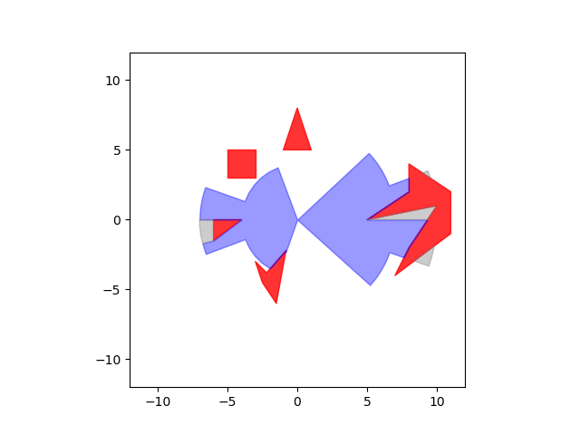
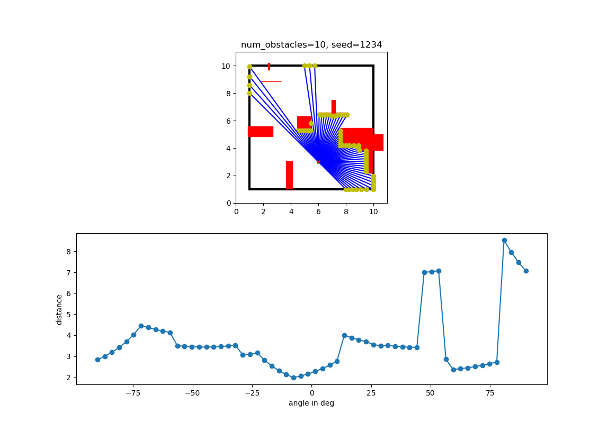

# POLYVISION



This package as been developed at [FZI Forschungszentrum Informatik](https://www.fzi.de) and the core of it is used in the [P3IV Simulator](https://p3iv.readthedocs.io/en/latest/). It provides polygon intersection and offsetting operations for visible area calculations.

This version has been developed further such that it not only lets you calculate the visible area, given a field of view polygon and some obstacles, but also simulates a 1D Lidar sensor in a 2D world (see below).

### [Doxygen documentation](/doxygen/index.html)
### [Coverage report](/coverage/index.html)

## Demo of Polyvision
### Example VisibleArea class
In Python:

    # origin
    _position = np.array([0, 0])
    # set up field of view
    fov2 = np.array([[0, 0],
                     [-5, 6],
                     [5, 6]])
    fov5 = np.array([[0, 0],
                     [3, -2],
                     [-3, -2]])
    _fieldOfView = [fov2, fov5]
    # set up polygons
    p1 = np.array([[-2, 2],
                   [-1, 2],
                   [0, 3]])
    p2 = np.array([[0, -1.5],
                   [-0.5, -1],
                   [1.3, -1]])
    p3 = np.array([[-2, 4],
                   [3, 4], [1, 5]])
    p4 = np.array([[2, 3],
                   [1, 2],
                   [1, 0], [2, 2]])
    perceptedPolygons = [p3, p4, p1, p2]

    # create visibleArea object for calculations
    visA = VisibleArea(_position, _fieldOfView, perceptedPolygons)
    # calculate visible area
    visA.calculateVisibleArea()

    results = [visA.getFieldsOfView(), visA.getOpaquePolygons(),
                   visA.getVisibleAreas(), visA.getNonVisibleAreas(), visA.getCentralProjectedOpaquePolygons()]

Visible area returned in blue and the non-visible area in grey (not the result from example above):


### Example BeamDataGenerator class
Output of `scripts/show_beams.py`:


## Usage of Polyvision C++ Package in Python

The Polyvision package uses internally the CGAL library for polygon intersection and clipping. It calculates the visible area as list of 2D polygons given a field of view (list of 2D polygons) and some obstacles (also list of 2D polygons).  
Internally a VisibleArea object stores the fieldOfView polygons and the obstacle polygons in lists. The maximum precision for the coordinates of the polygon edges is 6 decimals.

This is how to use this package:

* The visible areas as well as the opaque polygons are passed to the constructor of the VisibleArea class as list of numpy arrays of shape (nx2), where n is the number of points of the polygon
* The origin is passed to the constructor as numpy array of shape (1x2)
* After the visible area object has been created, the function *calculateVisibleArea(bool mergeFieldsOfView = true, bool printEachStep = false)* must be called. 
  * if mergeFieldsOfView = true, there will be only one contiguous visible area returned, otherwise the respective visible areas as a list
  * if printEachStep = true, the results will be printed on the console
* Next, the results can be accessed with the getter functions:
  * py::list getVisibleAreas() const;
  * py::list getNonVisibleAreas() const;
  * py::list getCentralProjectedOpaquePolygons() const;
  * py::list getOpaquePolygons() const;
  * py::list getFieldsOfView() const;
  * py::array_t<double> getOrigin() const;
  * double getRange() const;

Limitations:
  * The origin must never be inside an opaque polygon.

## Installation

As this repo presents a catkin package you should have the [catkin_tools](https://catkin-tools.readthedocs.io/en/latest/installing.html) installed. 

For building Polyvision requires the [mrt_cmake_modules](https://github.com/KIT-MRT/mrt_cmake_modules) package, which should be placed also in the `src` folder in the catkin workspace.

After installing the catkin_tools and cloning the mrt_cmake_modules repo your catkin workspace should look like:

```
├── src                         
│   ├── mrt_cmake_modules
│   ├── polyvision
│   └── ...               # other packages
│       
└── .catkin_tools                  
```

Polyvision requires `CGAL > 5.0`, which is a header only library. The older versions are not header only. 

Assuming you use Ubuntu, you can install its [debian package](https://packages.ubuntu.com/focal/libcgal-dev). Make sure that you have installed its dependecies as well:
```
libboost-dev
libboost-program-options-dev
libboost-system-dev
libboost-thread-dev
libgmp-dev
libmpfr-dev
zlib1g-dev
libmpfi-dev
libntl-dev
libtbb-dev
```

